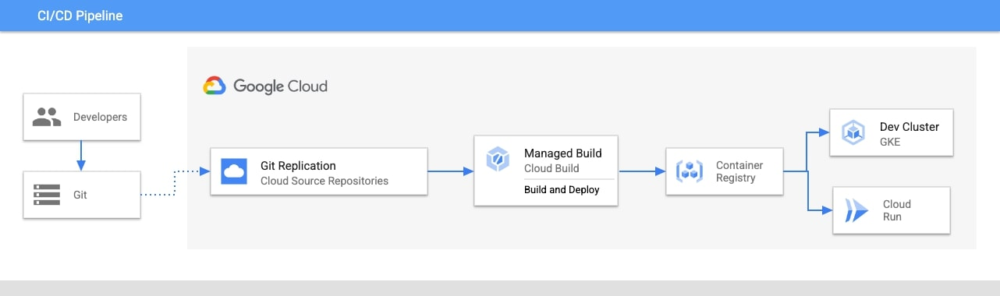

# CI/CD Pipeline Starter Pack

## Table of Contents
1. [Summary](#summary)
1. [Org Policies](#organizational-policies)
1. [Output Resources](#organizational-policies)
1. [Network Diagram](#network-diagram)
1. [Product Links](#product-links)
1. [Release Notes](#release-notes)

## Summary

This starter pack will launch a CI/CD pipeline which utilizes a sample point of sale application. The application is stored in a Cloud Source Repository and two respective Cloud Triggers provision the application from the repository to Cloud Run and GKE.

## Organizational Policies

The following Argolis Default organization policies have been modified:

* Cloud Run Public Access

## Output Resources
* Cloud Source Repository
* Cloud Build Triggers
  * Cloud Run Trigger
  * GKE Trigger
* VPC
  * One subnet (us-central1)
* GKE Service Account
* Private GKE Cluster
  * us-central1
* Operation Suite
  * Cloud Logging
  * Cloud Monitoring

## Network Diagram

## Product Links
* [Cloud Repositories](https://cloud.google.com/source-repositories/docs)
* [Cloud Build](https://cloud.google.com/build)
  * [Cloud Build Triggers](https://cloud.google.com/build/docs/automating-builds/create-manage-triggers)
* [Container Registry](https://cloud.google.com/container-registry)
* [GKE](https://cloud.google.com/kubernetes-engine)
* [VPC](https://cloud.google.com/vpc)
* [Cloud Run](https://cloud.google.com/run)

## Release Notes
* 12/12/22 - Inital Release
